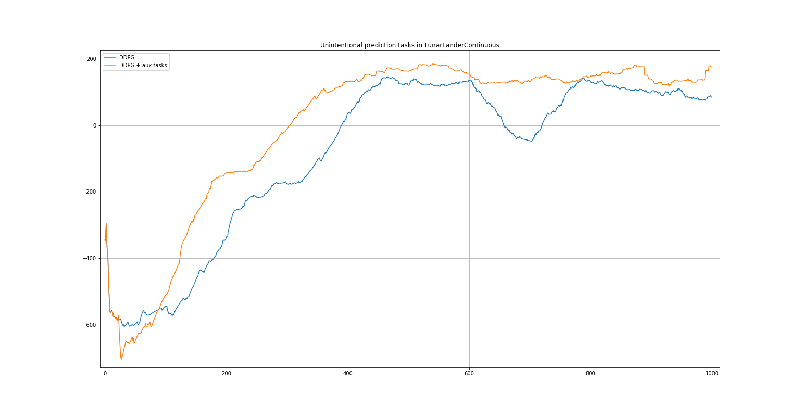

# RL-Box
Sandbox for Reinforcement Learning experimentation

## Implemented

- DDPG (Deep Deterministic Policy Gradient)
	- Target Networks
	- Experience Replay
	- Action noise: Gaussian, Ornstein–Uhlenbeck
	- Parameter noise
	- Layer Normalisation

## Experiments

### "Unintentional" auxiliary prediction tasks

